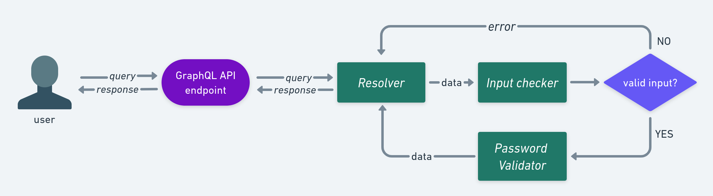

<p align="center">
  <a href="./README.md">Versão em Inglês </a>
  <span>:us:</span>
</p>


<details>
<summary>Tabela de Conteúdos</summary>

<!-- # Tabela de conteúdos -->
* [O projeto](#o-projeto)
    * [Fluxo de dados](#fluxo-dos-dados)
* [Executando o projeto](#executando-o-projeto) 
    * [Com Docker](#com-docker)
    * [Sem Docker](#sem-docker)
* [Consumindo a API](#consumindo-a-api)
    * [Formato da Query](#formato-da-query)
    * [Formato das Regras](#formato-das-regras)
* [Testes de unidade e integração](#testes-de-unidade-e-de-integração)
* [Estrutura de diretórios](#estrutura-de-diretórios-do-projeto)
</details>

# O projeto
API GraphQL que realiza a validação de senha se baseando em um conjunto de regras de validação de senha escolhidas pelo usuário.

Principais tecnologias utilizadas:
* Golang
* [Gqlgen](https://gqlgen.com/)
* Docker

## Fluxo dos dados


O fluxo de dados (demonstrado pela figura acima), de maneira simplificada, é definido da seguinte maneira: o usuário realiza uma `query` informando uma senha e um conjunto de regras de validação de senha. As regras escolhidas pelo usuário serão utilizadas para validar a senha informada.

A `query` é recebida pelo `resolver`, o qual extrai os dados da query e os representa dentro da API, posteriormente repassa os dados para o `input check`, módulo responsável por validar se o formato dos dados estão corretos. Por exemplo, no caso das regras, elas podem ser uma lista vazia `[]` (nesse cenário toda senha será válida), entretanto, quando definidas, devem respeitar o formato `{ rule: <NOME_DA_REGRA>, value: <VALOR_DA_REGRA> }`. Como exemplo, uma regra sem campo `<value>` (ex: `{ rule: <regra> }`) não respeita o formato esperado, logo é inválida. Outro ponto observado é o campo `<value>`. Esse campo não aceita valores negativos por definição, por exemplo, imagine que a regra escolhida é que a senha possua um número minímo de digitos, logo, não faz sentido que uma senha tenha no mínimo -1 dígito, por isso números negativos como valores de regras não são aceitos.

Se o formato do input não for respeitado um erro descritivo do problema é informado ao usuário. Se os dados estiverem no formato correto o fluxo continua e eles serão repassados para o módulo que valida a senha de fato, o `password validator`, que verifica se a senha cumpre as regras stabelecidas pelo usuário, o resultado desse processo é enviado ao usuário como resposta.

# Executando o projeto
## Com Docker
Garanta que dependências necessárias estão instaladas, sendo elas: Docker e Docker Compose (opcional, pois auxilia na construção da imagem e do container, mas essa ação pode ser feita manualmente).

Com o Docker Compose instalado acesse a pasta raiz do projeto e execute:
```bash
docker-compose up
```

Aguarde a construção da imagem e do container, após o processo completo a API estará disponível em http://localhost:8080/graphql

Obs: Se você optou por não utilizar o Docker Compose não há problemas, ainda é possível  construir o container manualmente com os seguintes comandos:

1. Construa a imagem
```bash
docker build -t <image-name> .
```

2. Depois, construa o container
```bash
docker run -p 8080:8080 <image-name>
```
Ao final, também obteremos a API executando em http://localhost:8080/graphql

## Sem docker
Certifique-se de instalar Go na versão 1.19.3 ou superior. Após isso, acesse a pasta do projeto e instale as dependências com o comando:
```bash
go mod download
```

Aguarde as dependências baixarem e execute:
```bash
go run server/server.go
```

Após isso, o servidor estará disponível em http://localhost:8080/graphql


# Consumindo a API
## Formato da query
Para consumir a API basta constrir uma query GraphQL no formato demonstrado abaixo. A query é usada para validar uma senha com base em um conjunto de regras.

```graphql
{
  verify(
    password:<PASSWORD>,
    rules: [{rule:<RULE_NAME>, value: <RULE_VALUE>}]
  ) {
    verify
    noMatch
  }
}
```
### Argumentos
A query consiste em um único campo chamado `verify`, que recebe dois argumentos: `password` e `rules`.

* `password (string)`: representa a senha a ser verificada.
* `rules (list[object])`: contém uma lista de objetos especificando as regras a serem aplicadas à senha. Cada objeto possui dois campos:
    * `rule (string)`: representa o nome da regra.
    * `value (int)`: representa o valor da regra.

### Fields
Para usar essa query basta substituir os placeholders `<PASSWORD>`, `<RULE_NAME>` e `<RULE_VALUE>` pelos valores desejados. O formato das regras é descrito abaixo [Formato da Regra](#Formato-da-regra)

O resultado retornado é um objeto com dois campos: `verify` e `noMatch`.

* `verify (boolean)`: resultado da validação da senha. `True` se a senha for válida, `False` se for inválida.
* `noMatch (list[string])`: lista de regras que não foram satisfeitas pela senha. Se a senha for válida essa lista estará vazia.

## Formato das regras
As regras para validar as senhas possuem o seguinte formato:

`{rule:<RULE_NAME>, value: <RULE_VALUE>}`

`rule` é uma `string` e representa o nome da regra e `value` são inteiros positivos.

A tabela abaixo exibe as regras disponíveis para a validação de senha.

| nome da regra          | valores aceitos                        | descrição |
| ------------- | ---------------------------- | ---------------------------- |
`minSize`         | inteiro positivo (ex: 1,2,3,4...) | define um tamanho mínimo
`minUppercase`    | inteiro positivo | define uma quantidade mínima de letras maíusculas
`minLowercase`    | inteiro positivo | define uma quantidade mínima de letras minúsculas
`minDigit`        | inteiro positivo | define uma quantidade mínima de digitos (0-9)
`minSpecialChars` | inteiro positivo | define uma quantiade mínima de caracteres especiais (ex: `!`, `@`, `#`, `$`, `%`, `^`, `&`, `*`, `(`, `)`, `-`,`+`,`/`,`{`,`}`,`[`,`]`)
`noRepeted`       | inteiro positivo (esse valor será ignorado) | define que dois ou mais caracteres sequencias não devem se repetir (ex: senha é válido, mas seenha não, pois o caractere `e` se repetiu de maneira sequencial)

# Testes de unidade e de integração
O projeto é coberto por testes de unidade e de integração. Para executar os testes:

* Em sistemas Unix. 
Basta executar o script `run_tests.sh com o comando:`
```bash
bash run_tests.sh
```

* Em sistemas Windows para executar um script bash se faz necessário alguns programas extras (como Cygwin), por isso recomendo que simplesmente execute diretamente o comando contido no script `run_test.sh`, ou seja
```bash
go test graphpass graphpass/password graphpass/utils -cover
```

# Estrutura de diretórios do projeto
```
.
├── graph
│   ├── model                   // modelos graphql
│   │   └── models_gen.go
│   ├── resolver                
│   │   ├── resolver.go
|   |   └── verify.go           // resolver que lida com a query verify
│   ├── schema
│   |   └── schema.graphqls     // schema graphql
│   └── generated.go            // código gerado em runtime pelo pacote gqlgen
│
├─ password                     // módulo de validação de senha baseado em regras
│  ├── password_check_test.go   
|  └── password_check.go        
│
├─ server
│  └── server.go                // api entrypoint
│
├─ utils                        // utilitários que ajudam a validar e estruturar os dados de input
│  ├── map2struct_test.go       
│  └── map2struct.go            
│
├─ api_integration_test.go      // testes de integração da API
├─ docker-compose.yml
├─ Dockerfile
├─ go.mod                       // gerencia a lista de pacotes da aplicação
├─ go.sum                       // garantia de integridade dos pacotes
├─ gqlgen.yml                   // arquivo de configuração biblioteca gqlgen
├─ README.md
└─ run_tests.bash               // script que executa todos os testes
```